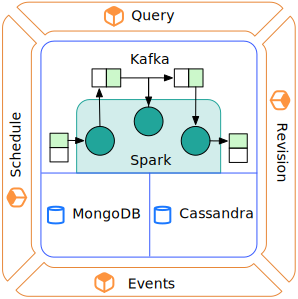
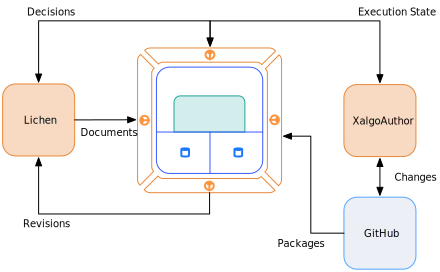

# Summary

This document describes the fundamental architecture of the **XA Data
Fabric** platform (XADF). The primary role of the platform is to
discover, refine and execute rules in order to revise documents. It is
a [cloud-native](https://www.cncf.io/about/faq/) application heavily
influenced by concepts from
[serverless](https://github.com/cncf/wg-serverless/tree/master/whitepaper)
and
[CQRS](https://en.wikipedia.org/wiki/Command–query_separation). The
primary framework for the platform is
[SMACK](mesosphere.com/blog/smack-stack-new-lamp-stack/).

# Terminology

Within the project, there exists a specialized terminology derived
from the [team's writing on an Internet of
Rules](https://internetofrules.org/).

## Rule

A piece of logic that should be applied to a document. Represented in
XALGO format.

## Document

A hierarchical key-value collection of data related to a business
transaction.

## Table

A static, columnar collection of information used by a rule to make
decisions.

## Table-based

A method of organising computational logic where decisions are made by
matching keys in tables rather than via branching logic.

## Revision

A change to a document in the data Fabric. The Fabric considers all
submitted documents to be immutable, therefore any changes to the
document that are recommended post rule execution are retained as
*revisions* to the original document. Changes are organised by time of
execution, therefore a revision that occurs **after** a previous
revision represents a **new** execution of the rule set and **not** a
modification of the previous revision.

## Integration

An application that uses the data Fabric.

# Architecture

There are are three distinct sections to the architecture of the platform:

* *Operations*: This the the public API of the platform. Integrated
  applications use this section to schedule documents for application
  of rules, receive notifications on completed computations and query
  information about the system and past computations.
  
* *Storage*: The persistent storage of data related to the
  application. This section uses a heterogenous data storage solution
  currently based on Mongo and Cassandra.
  
* *Compute*: This is the core kernel of the platform where rules are
  discovered and applied to documents. It is a *network of Spark jobs*
  orchestrated via Kafka.

## Storage

The persistent storage used by the Fabric is maintained in two
distinct databases: a document-oriented database (Mongo) and a
distributed database. The primary source of truth in the system
derives from the at-rest domain data (rules, tables, documents) that
is stored in the document database. The distributed database
(Cassandra) is used to provide runtime data to the Compute jobs. For
detailed information, refer to the [data storage](./data.storage.md)
document.

By design, Storage will be deployed and managed *independently* of the
other sections in the architecture. This will allow the critical core
functionality provided by Compute to operate at arms length of this
Layer. With this separation in place, the core functionality can be
improved incrementally and deployed against different Storage systems
that do not retain sensitive financial information from day-to-day
operations. This will facilitate testing and improve development to
deployment turn-around time.

## Compute

The computing kernel of the Fabric is designed as a *network of topics
and jobs*. Every computational *task* is broken into a number of steps
(or jobs) that perform *part* of the computation. As each job
completes, the results of the job are posted to a topic. Subsequent
jobs listen to these topics and continue the computation as data
becomes available.

In practise, the network is formed from Kafka topics and and Spark
jobs that use the Spark Streaming API.

This design allows arbitrary computations to be composed from
component parts implemented in Spark. The network of topics that
orchestrates the stream of data between the jobs can be arranged to
form new logical structures.

Currently, the only orchestration that is implemented in the kernal is
that described by the [Lichen specific pipeline](./pipeline.md).

## Operations

This section provides the public API access to the kernel in order to
schedule computations, to receive results and to query for information
from the system. Services in this section will also provide
*integrations with external services* (for example:
[GitHub](./xalgo.md#packaging) in the case of the Revisions service).

## Schedule

The [Schedule service](https://github.com/Xalgorithms/xadf-schedule)
is the primart starting point for any integration with the
Fabric. Documents are submitted to this service and they are
automatically scheduled for asynchronous computation in the kernel. A
document that is accepted by this service will be **permanently
retained** in the document database in the storage section.

## Events

The [Events](https://github.com/Xalgorithms/xadf-events) service
offers a WebSocket and REST endpoint that can be used by integrations
to *observe the completion* of jobs scheduled in the kernal. For now,
these are the only events sent from the service. In the future, more
events may be added.

## Query

[This service](https://github.com/Xalgorithms/xadf-query) offers a
simple API for integrations to query historical information *related
to documents or revisions* that is retained in the document
database. It **does not provide access** to the distrubuted
database. For example, if a document has a number of revisions, an
integration may request an older revision to be applied to the
document or it may request the revision itself.

Additionally, this service will provide access to compute metadata to
allow integrations to understand the progress or context of a
particular **completed** computation in the kernel.

## Revisions

The [Revisions service](https://github.com/Xalgorithms/xadf-revisions)
is an *integration service*. It **does not** offer a public API. The
[primary responsability](./xalgo.md#authoring-and-publishing) of this
service is to receive web hook calls from GitHub and store updated
rules and tables.

# Deployment

Following the SMACK concepts, the entire Fabric is deployed to Apache
Mesos. The Spark and Cassandra components are directly-managed using
the corresponding packages from the Mesos distribution. The public API
services are managed as
[Docker](https://en.wikipedia.org/wiki/Docker_(software)) containers
under Marathon.

# Integrations

An *integration* is a distinct application that, in some way,
communicates data to and from the Fabric via the public API
services. The current integrations are:

* [Lichen](./lichen.md): An application that builds or receives UBL
  formatted business documents. This application converts the UBL
  markup into the internal format of the Fabric and schedules
  computations. It also provides feedback on the results of the
  computation.
  
* [XalgoAuthor](./author.md): This application provides a UI for
  managing, creating and debugging rules, tables and rule packages. It
  integrates with GitHub for the versioning of rule packages and with
  the Fabric for debugging rule execution.
